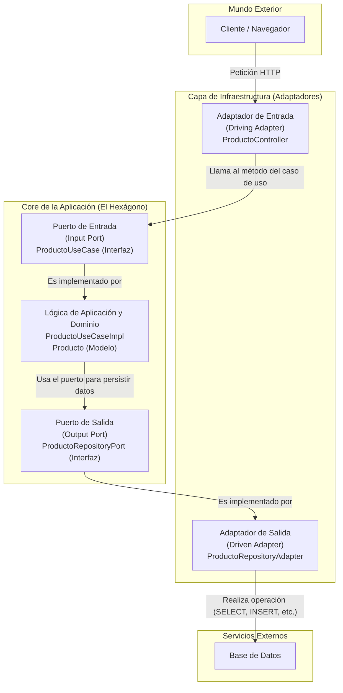
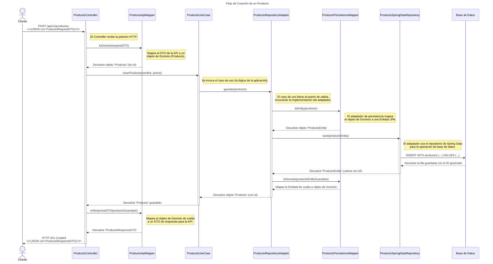

# Proyecto: API de Gestión de Productos (Arquitectura Hexagonal)

Este es un proyecto de ejemplo que implementa una API RESTful para la gestión de productos, utilizando **Arquitectura Hexagonal** (también conocida como Puertos y Adaptadores) con Java y Spring Boot. El objetivo principal es demostrar una estructura de aplicación desacoplada, mantenible y fácilmente testeable.

## Descripción del Proyecto

La aplicación permite realizar operaciones CRUD (Crear, Leer, Actualizar, Eliminar) sobre una entidad de "Producto". Está diseñada siguiendo los principios de la Arquitectura Hexagonal para separar claramente la lógica de negocio (dominio) de las preocupaciones de infraestructura (frameworks, bases de datos, APIs externas, etc.).

## Tecnologías Utilizadas

* **Lenguaje:** Java 21 (o la versión que estés usando, ej: 17)
* **Framework Principal:** Spring Boot 3.x (o la versión que estés usando)
* **Módulos de Spring:**
    * Spring Web (para la API RESTful)
    * Spring Data JPA (para la persistencia)
* **Base de Datos (Ejemplo Inicial):** H2 Database (en memoria)
* **Herramienta de Construcción:** Apache Maven (o Gradle, si lo prefieres)
* **Control de Versiones:** Git
* **Arquitectura:** Hexagonal (Puertos y Adaptadores)
* **Pruebas:** JUnit 5, Mockito (se añadirán más adelante)
* **Contenerización (Futuro):** Docker

## Prerrequisitos

Antes de comenzar, asegúrate de tener instalado lo siguiente:

* JDK (Java Development Kit) - Versión 17 o superior (recomendado 21)
* Apache Maven - Versión 3.6.x o superior (o Gradle si se usa)
* Git

## Cómo Empezar

Sigue estos pasos para poner en marcha el proyecto en tu entorno local:

1.  **Clonar el repositorio:**
    ```bash
    git clone <URL_DEL_REPOSITORIO_REMOTO>
    # Ejemplo: git clone [https://github.com/tu-usuario/mi-aplicacion-hexagonal.git](https://github.com/tu-usuario/mi-aplicacion-hexagonal.git)
    ```

2.  **Navegar al directorio del proyecto:**
    ```bash
    cd mi-aplicacion-hexagonal
    ```

3.  **Construir el proyecto (con Maven):**
    Esto descargará las dependencias y compilará el código.
    ```bash
    mvn clean install
    ```
    *(Si usas Gradle, sería algo como `./gradlew build`)*

4.  **Ejecutar la aplicación (con Maven):**
    ```bash
    mvn spring-boot:run
    ```
    *(Si usas Gradle, sería `./gradlew bootRun`)*

    Alternativamente, puedes ejecutar el archivo JAR generado (después de `mvn clean install`):
    ```bash
    java -jar target/mi-aplicacion-0.0.1-SNAPSHOT.jar
    # El nombre del JAR puede variar según la configuración en tu pom.xml
    ```

Una vez iniciada, la API estará disponible (por defecto) en `http://localhost:8080`. Puedes consultar los endpoints disponibles en el código del controlador (`ProductoController.java`).

## Endpoints Principales (Ejemplo Inicial)

* `POST /api/v1/productos`: Crea un nuevo producto.
* `GET /api/v1/productos/{id}`: Obtiene un producto por su ID.
* `GET /api/v1/productos`: Lista todos los productos.
* `PUT /api/v1/productos/{id}`: Actualiza un producto existente.
* `DELETE /api/v1/productos/{id}`: Elimina un producto.

*(Estos endpoints se detallarán más a medida que se desarrollen).*

## Evolución del Proyecto

Este `README.md` se actualizará continuamente a medida que se añadan nuevas funcionalidades, se mejore la configuración y se documenten aspectos adicionales del proyecto como:

* Estructura detallada del proyecto.
* Guías de contribución.
* Configuración de la base de datos para entornos de desarrollo y producción.
* Estrategias de prueba.
* Instrucciones para la Dockerización.
* Documentación de la API (ej. Swagger/OpenAPI).

---

## Diagrama Alto Nivel




## Diagrama de Secuencia


